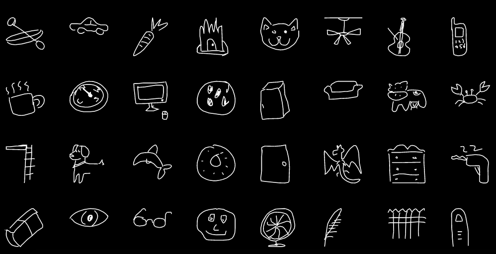

# Sketcher

Sketcher is a simple yet fun one-page web app where you can draw something, and a machine learning model will try to guess what it is - using the [Google Quick, Draw! Dataset](https://github.com/googlecreativelab/quickdraw-dataset) as its training base.

---

## Live Demo

Try it out on [https://darthbirb-sketcher.web.app](https://darthbirb-sketcher.web.app)

---

## How it Works

1. You draw something on the canvas.
2. The frontend sends your sketch (as a base64 image) to the Flask backend.
3. The backend preprocesses the image and feeds it to a trained CNN model.
4. The model predicts the top 3 most likely labels, which are shown on-screen with their confidence percentages.

---

### Dataset Information

Here are some samples from the Google Quick, Draw! dataset:



Here are all the categories present in the dataset:

<details>
<summary>Dataset Categories</summary>

**aircraft carrier**, **airplane**, **alarm clock**, **ambulance**, **angel**, **animal migration**, **ant**, **anvil**, **apple**, **arm**, **asparagus**, **axe**, **backpack**, **banana**, **bandage**, **barn**, **baseball**, **baseball bat**, **basket**, **basketball**, **bat**, **bathtub**, **beach**, **bear**, **beard**, **bed**, **bee**, **belt**, **bench**, **bicycle**, **binoculars**, **bird**, **birthday cake**, **blackberry**, **blueberry**, **book**, **boomerang**, **bottlecap**, **bowtie**, **bracelet**, **brain**, **bread**, **bridge**, **broccoli**, **broom**, **bucket**, **bulldozer**, **bus**, **bush**, **butterfly**, **cactus**, **cake**, **calculator**, **calendar**, **camel**, **camera**, **camouflage**, **campfire**, **candle**, **cannon**, **canoe**, **car**, **carrot**, **castle**, **cat**, **ceiling fan**, **cello**, **cell phone**, **chair**, **chandelier**, **church**, **circle**, **clarinet**, **clock**, **cloud**, **coffee cup**, **compass**, **computer**, **cookie**, **cooler**, **couch**, **cow**, **crab**, **crayon**, **crocodile**, **crown**, **cruise ship**, **cup**, **diamond**, **dishwasher**, **diving board**, **dog**, **dolphin**, **donut**, **door**, **dragon**, **dresser**, **drill**, **drums**, **duck**, **dumbbell**, **ear**, **elbow**, **elephant**, **envelope**, **eraser**, **eye**, **eyeglasses**, **face**, **fan**, **feather**, **fence**, **finger**, **fire hydrant**, **fireplace**, **firetruck**, **fish**, **flamingo**, **flashlight**, **flip flops**, **floor lamp**, **flower**, **flying saucer**, **foot**, **fork**, **frog**, **frying pan**, **garden**, **garden hose**, **giraffe**, **goatee**, **golf club**, **grapes**, **grass**, **guitar**, **hamburger**, **hammer**, **hand**, **harp**, **hat**, **headphones**, **hedgehog**, **helicopter**, **helmet**, **hexagon**, **hockey puck**, **hockey stick**, **horse**, **hospital**, **hot air balloon**, **hot dog**, **hot tub**, **hourglass**, **house**, **house plant**, **hurricane**, **ice cream**, **jacket**, **jail**, **kangaroo**, **key**, **keyboard**, **knee**, **knife**, **ladder**, **lantern**, **laptop**, **leaf**, **leg**, **light bulb**, **lighter**, **lighthouse**, **lightning**, **line**, **lion**, **lipstick**, **lobster**, **lollipop**, **mailbox**, **map**, **marker**, **matches**, **megaphone**, **mermaid**, **microphone**, **microwave**, **monkey**, **moon**, **mosquito**, **motorbike**, **mountain**, **mouse**, **moustache**, **mouth**, **mug**, **mushroom**, **nail**, **necklace**, **nose**, **ocean**, **octagon**, **octopus**, **onion**, **oven**, **owl**, **paintbrush**, **paint can**, **palm tree**, **panda**, **pants**, **paper clip**, **parachute**, **parrot**, **passport**, **peanut**, **pear**, **peas**, **pencil**, **penguin**, **piano**, **pickup truck**, **picture frame**, **pig**, **pillow**, **pineapple**, **pizza**, **pliers**, **police car**, **pond**, **pool**, **popsicle**, **postcard**, **potato**, **power outlet**, **purse**, **rabbit**, **raccoon**, **radio**, **rain**, **rainbow**, **rake**, **remote control**, **rhinoceros**, **rifle**, **river**, **roller coaster**, **rollerskates**, **sailboat**, **sandwich**, **saw**, **saxophone**, **school bus**, **scissors**, **scorpion**, **screwdriver**, **sea turtle**, **see saw**, **shark**, **sheep**, **shoe**, **shorts**, **shovel**, **sink**, **skateboard**, **skull**, **skyscraper**, **sleeping bag**, **smiley face**, **snail**, **snake**, **snorkel**, **snowflake**, **snowman**, **soccer ball**, **sock**, **speedboat**, **spider**, **spoon**, **spreadsheet**, **square**, **squiggle**, **squirrel**, **stairs**, **star**, **steak**, **stereo**, **stethoscope**, **stitches**, **stop sign**, **stove**, **strawberry**, **streetlight**, **string bean**, **submarine**, **suitcase**, **sun**, **swan**, **sweater**, **swing set**, **sword**, **syringe**, **table**, **teapot**, **teddy-bear**, **telephone**, **television**, **tennis racquet**, **tent**, **The Eiffel Tower**, **The Great Wall of China**, **The Mona Lisa**, **tiger**, **toaster**, **toe**, **toilet**, **tooth**, **toothbrush**, **toothpaste**, **tornado**, **tractor**, **traffic light**, **train**, **tree**, **triangle**, **trombone**, **truck**, **trumpet**, **t-shirt**, **umbrella**, **underwear**, **van**, **vase**, **violin**, **washing machine**, **watermelon**, **waterslide**, **whale**, **wheel**, **windmill**, **wine bottle**, **wine glass**, **wristwatch**, **yoga**, **zebra**, **zigzag**

</details>

---

## Tech Stack

| Layer     | Technology                                  |
|-----------|---------------------------------------------|
| Frontend  | React + Vite + Tailwind CSS + shadcn        |
| Backend   | Flask + TensorFlow                          |
| Model     | CNN trained on Google QuickDraw             |
| Hosting   | Firebase (frontend), GCP Cloud Run (backend)|
| Dev Tools | Docker, VSCodium, Anaconda                  |

---

## Deployment

If you'd like to run the code locally, please clone the repository and run the following:

### Backend (Flask with Docker - in Sketcher/web-app/backend)

```bash
docker build -t sketcher-backend .
docker run -p 5000:5000 sketcher-backend
```
Make sure you have Flask and Docker installed.

### Frontend (React + Vite - in Sketcher/web-app/frontend)

```bash
npm install
npm run dev
```
You just need node installed for this.

---

## License

Licensed under the [MIT License](LICENSE)

---

## Acknowledgments

- Google Creative Lab for the [Quick, Draw! dataset](https://quickdraw.withgoogle.com/)